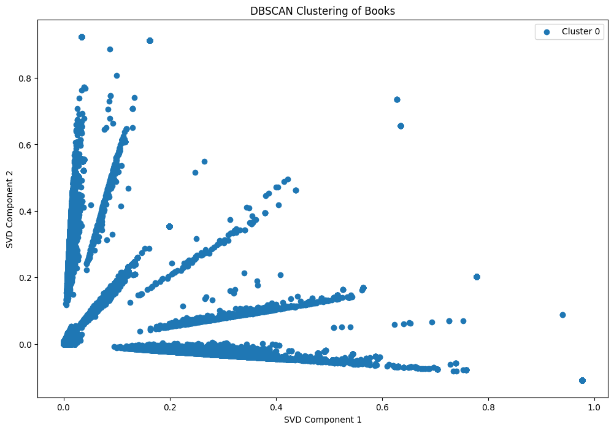

# Book Review Analysis and Recommendation System

## Business Understanding

The days of customers walking into a shop to buy what they need/want are long behind us and worse still if these are items are not basic needs. More and more clients prefer to make purchases from the comfort of their home. The goods that a retailer is able to market online is limitless however customers easily get tired of scrolling though an endless catalogue of items for sale.
Therefore rises the need for a recommendation system that will enable a client have a seamless buying experience. The reading culture is changing hence our choice of the amazon books dataset. A recommendation system will enable buyers get the most ideal and trending books to buy. The target audience would be both the retailers and the purchasers.

## Overview
The notebook is structured as follows:

    - Importing Libraries and Data
    - Data Preprocessing
    - Exploratory Data Analysis
    - Feature Engineering
    - Model Building
    - Evaluation
    - Clustering Analysis
    - Recommendation Generation
    - Conclusion
    - Recommendation

## Importing  Data
- The data has been obtained from https://amazon-reviews-2023.github.io/ and in jsonl format. An efficient format for storing data that is unstructured or produced over time.

- It contains a list of books sold in Amazon. The original dataset contains 4 million rows, from 1996 to 2023. We will trim it to the most recent 300k to make it easier to work with.

The data contains following features/columns in the dataset.
| Column Name | Description |
|---|---|
| rating | Rating of the product (from 1.0 to 5.0). |
| title_x | Title of the user review. |
| text | Text body of the user review. |
| images | Links to images (comma-separated if multiple). |
| asin(product key) | Unique identifier for the product. |
| parent_asin | Identifier for the parent product (applicable for variations). |
| user_id | Unique identifier for the reviewer. |
| timestamp | Date and time of the review. |
| helpful_vote | Number of helpful votes received by the review. |
| verified_purchase | Indicates whether the reviewer purchased the product (True/False). |
| main_Category | Main category (domain) to which the product belongs (e.g., Electronics, Clothing). |
| title_y | Name of the product as mentioned in the review. |
| price | Price of the product in US dollars. |

## Exploratory Data Analysis
- The dataset contains 300000 rows and 13 columns.
    - Book ratings were on a scale of 1 to 5. Below is a table showing the rating of books with the corresponding count.

| Rating | Count  |
|--------|--------|
| 1      | 18,798 |
| 2      | 9,954  |
| 3      | 14,855 |
| 4      | 32,038 |
| 5      | 224,355|

## Data Preprocessing
In this stage we dropped rows with duplicate book titles and also rows with null values. We renamed some of the columns: 'title_x' to 'title_rating', 'title_y' to 'title_book'.
- We eventually dropped columns that were not necessary for the modelling and ended up having 137725 row and 6 columns.

      - rating
      - title_rating
      - text
      - user_id
      - verified_purchase
      - title_book
      - price
- The price columns was cleaned by filling null values with the mean price. Also converted to float data type.
- 'main_category' did not accurately give the book categorys thus being dropped. Below are the categories

| Main Category               | Count  |
|-----------------------------|--------|
| Books                       | 247,285|
| Buy a Kindle                | 44,247 |
| Audible Audiobooks          | 8,214  |
| Others                      | 204    |
| Toys & Games                | 29     |
| Amazon Home                 | 14     |
| Office Products             | 7      |
| Musical Instruments         | 6      |
| Arts, Crafts & Sewing       | 2      |
| AMAZON FASHION              | 1      |
| Tools & Home Improvement    | 1      |
| Industrial & Scientific     | 1      |

- 'title_x' column was renamed to 'title_rating' and 'title_y' to 'title_book'. The values were converted to lowercase and all punctuations removed. The values were tokenized and stopwords removed.
- The top 15 common words in 'tokenized_title_rating'are:

| Word      | Count  |
|-----------|--------|
| book      | 51,383 |
| great     | 37,020 |
| read      | 23,177 |
| good      | 17,009 |
| love      | 12,440 |
| story     | 11,124 |
| fun       | 7,544  |
| excellent | 6,652  |
| amazing   | 6,502  |
| beautiful | 5,817  |
| best      | 4,913  |
| series    | 4,907  |
| cute      | 4,660  |
| loved     | 4,636  |

## Model Building
- We started with sentiment analysis. The goal was to understand the sentiment expressed in the review text (positive or negative). The sentiment analysis here included algorithms involving Multinomial Naive Bayes analysis, Support Vector Machines (SVM) and Random Forest. We used the precision, recall, f1-score & support to compare their performance.

### Evaluation
- Below is assessment

Multinormial Naive Bayes

| Class Label | Precision | Recall | F1-Score | Support |
|---|---|---|---|---|
| 0 | 0.83 | 0.44 | 0.58 | 8810 |
| 1 | 0.91 | 0.98 | 0.95 | 51190 |
| (Total) | **0.90** | **0.91** | **0.89** | 60000 |

SVM

| Class Label | Precision | Recall | F1-Score | Support |
|-------------|-----------|--------|----------|---------|
| 0           | 0.80      | 0.46   | 0.59     | 8,810   |
| 1           | 0.91      | 0.98   | 0.95     | 51,190  |
| (Total)     | **0.90**  | **0.90** | **0.89** | 60,000 |

Random Forest

| Class Label | Precision | Recall | F1-Score | Support |
|-------------|-----------|--------|----------|---------|
| 0           | 0.77      | 0.54   | 0.63     | 8,810   |
| 1           | 0.92      | 0.97   | 0.95     | 51,190  |
| (Total)     | **0.90**  | **0.91** | **0.90** | 60,000 |

- All three classification models (Multinomial Naive Bayes, SVM, and Random Forest) achieved high accuracy (around 90%) in sentiment analysis.
- Multinomial Naive Baye has a slight edge in identifying positive reviews with a recall of 0.98, but it struggles more with negative reviews  with a recall of 0.44. SVM and Random Forest show similar performance generally. They perform well in identifying positive reviews and slightly better than Naive Bayes on negative reviews; recall around 0.54-0.46.
- Naive Bayes might be slightly better at capturing positive sentiment, while SVM and Random Forest offer a more balanced performance between positive and negative reviews.

### Recommendation System
- **Build the content-based recommendation system.**
  - We created a TF-IDF matrix from the lemmatized text.
  - Compute cosine similarity between items based on their TF-IDF vectors.
  - Defined a function to get recommendations for a given book title.

This approach recommends books based on the lemmatized_title_rating text.
  - Calculates TF-IDF vectors for "lemmatized_title_rating". Recommends books with the highest cosine similarity to a user's preferred book.
  - Keyword matching: Extract keywords from "lemmatized_title_rating".
  - Recommends the top 5 books with similar keywords to a user's preferred book.

- Using DBSCAN Clustering

## Conclusion
- From the plot we see some books are isolated. This may mean:
  - The book may have unique content that sets it apart from others, leading to distinct patterns in its reviews
  - The reviews for the book might be highly diverse, making it difficult for the algorithm to place it within a specific cluster of similar reviews.
  - There may not be enough review data for the book, resulting in sparse feature representation and subsequent isolation in the clustering process.
- Some of the challenges that are like to affect the model performance are:
  - Semantic ambiguity, where words can have multiple meaninings
  - High dimensionality. This was a major computational challenge during for the algorithims and also for visualizations.

## Recommendations
Based on the DBSCAN clustering analysis of book reviews, here are some recommendations for further exploration:

  1. Examine the outlier books to understand what makes them unique. They could be books with unusual themes that might interest a specific audience.
  2. Combine the clustering results with other book metadata like genre and author to create a more comprehensive recommendation system.
  3. More time to have tune the algorithms to effectively and efficiently perform given the computational challenges
  
### Contributors
- Jacqueline Chepkwony
- Mark Kuria
- Peter Muthoma
- Nicholas Njubi
- Johnmark Kibui

